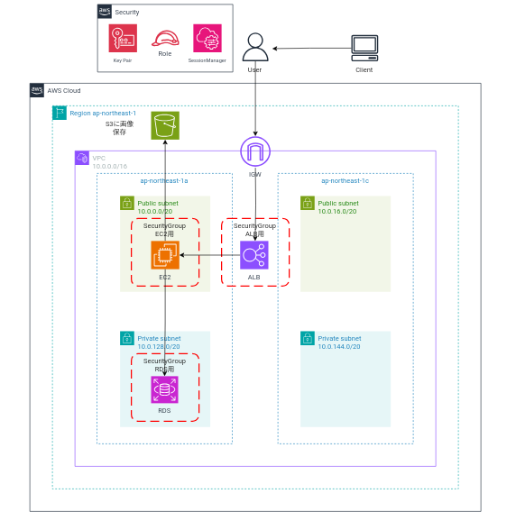

# terraform-AWS
## Raisetech第5回課題にて作成したAWSリソースをterraformで作成

--------

#### 以下の構成図に基づいて、terraformリソースを作成します。



## 前準備

### Terraformの使用準備 

####  1. AWS CLIをインストール
####  2. AWS CLIに環境変数で認証情報を登録し、terraformの操作をできるようにする
     
* [AWS CLIのインストール方法・認証情報の登録方法はこちら](https://github.com/tushiko23/CLI-AWS/blob/modify/cLI-command/cli-install.md)

####  3. LocalPCにTerraformをインストール(今回は`tfenv`を使用してインストール)
* [`tfenv`でのインストール手順はこちら](task/environment/tf-environment.md)
* [`wget`と`unzip`をインストールして、Terraformを使用する方法はこちら](task/environment/tf-wzip-install.md) 

   <def>(今回は`tfenv`を用いてTerraformを使用するので、参考までに載せておきます)
####  4. `tree`コマンドのインストール(任意です、あると構成がわかるので便利)
```
sudo apt install tree
```
* [参考サイト](https://qiita.com/inakuuun/items/25d08162b91fa4991549)

### Providerの設定

AWSのリソースを作成できるように、Provider.tfにProviderを定義する

TerraformのAWSにおけるProviderとは
* TerraformがAWSのリソースを管理・操作できるようにするためのインターフェース。具体的には、プロバイダーはAWSのAPIとTerraformの間の橋渡し役を果たす。Terraformを使ってAWSのインフラをコードで定義し、リソースを作成、更新、削除することができる。

<details><summary>実行して表示されるコードブロック</summary>

```
# provider.tfに記述
# AWSプロバイダーのバージョンは3.0以降を設定

terraform {
  required_providers {
    aws = {
      source  = "hashicorp/aws"
      version = "~> 3.0"
    }
  }
}

# "ap-northeast-1" 東京リージョンを指定

provider "aws" {
  region = "ap-northeast-1"
  # AWSアクセスキー※今回はAWS CLIのcredentialsに認証情報を記述するので不要
  # ハードコーディングよりは、変数化 or 環境変数 or profile指定を利用
  # Cloud9を利用する場合は、access_key・secret_keyの記述が必要
  # 今回はCloud9のAMTCを利用するので以下2つ記述不要
  # access_key = "my-access-key"
  # secret_key = "my-secret-key"
}
```
</details>


* [Cloud9のAMTCについてはこちら](https://dev.classmethod.jp/articles/aws-cloud9-aws-managed-temporary-credentials/)
* 使用するAWSプロバイダーのバージョンは3.0以降(つまり、3.×.×など)を指定。
* 構築するAWSリソースは`ap-northeast-1`東京リージョンを使用するよう指定
* 後ほど、SSH接続のためのキーペア作成に必要な`TLSプロバイダー`、SGの許可22ポートのマイIP取得に必要な`HTTPプロバイダー`、キーペアをLocalPCの指定ファイルに保存するために`Localプロバイダー`を設定します。リソース作成のタイミングで説明します。
### Terraformコマンドの説明

#### 1. `terraform init`コマンド
* init=初期化のこと。初期化して、Providerに対応したバイナリファイルをDLさせる。
* バイナリファイルは.terraformという隠しフォルダに格納される(`ls -la`で存在確認可)
* providerの変更・追加、modulesの変更・追加など、init後に前提条件を変更した際には再実行が必要。

実行すると、
<details><summary>実行して表示されるコードブロック</summary>

```
$ terraform init

Initializing the backend...
Initializing provider plugins...
- Reusing previous version of hashicorp/aws from the dependency lock file
- Using previously-installed hashicorp/aws v3.76.1

Terraform has been successfully initialized!

You may now begin working with Terraform. Try running "terraform plan" to see
any changes that are required for your infrastructure. All Terraform commands
should now work.

If you ever set or change modules or backend configuration for Terraform,
rerun this command to reinitialize your working directory. If you forget, other
commands will detect it and remind you to do so if necessary.
```
</details>

***Terraform has been successfully initialized!*** が表示されると、成功！

#### 2. `terraform fmt`コマンド
* fmt=コード整形 Terraformはコード整形するのがスタンダードとなっていて、記述したファイルの=の位置等を揃える役割。
* コードを書いたら、実行するのが一般的。揃っていない場合は揃えたファイルが表示され、揃えるファイルがない場合は何も表示されない。

<details><summary>実行して表示されるコードブロック</summary>

```
# provider.tfのコード整形
$ terraform fmt
provider.tf
```
</details>

#### 3. `terraform validate`コマンド
* validate=構文チェック Terraformにはバリデーション（記述が正しいかのチェック）機能もある。
* 成功すると、***Success! The configuration is valid.*** が表示され、エラーがあると、エラー箇所が表示される。

<details><summary>実行して表示されるコードブロック</summary>

```
# 成功の場合
$ terraform validate
Success! The configuration is valid.

# エラーが出る場合
$ terraform validate

╷
│ Error: Reference to undeclared resource
│ 
│   on alb.tf line 12, in resource "aws_alb_target_group" "test_target_group":
│   12:   vpc_id = aws_vpc.main_vpc.id
│ 
│ A managed resource "aws_vpc" "main_vpc" has not been declared in the root module.
```
</details>

#### 4. `terraform plan`コマンド
* plan=ドライラン いきなり構築を開始するのではなく、これからどのような処理が始まるか、事前に目視確認ができる。
* ***+が追加(add)***、***~が更新(change)***、***-が削除(destroy)*** になる。
* 想定外のdestroyリソースが存在しないか確認するのが大事。
* リソースによっては、変更にあたってdestroyが必須なものもある。
* planを使うことで、稼働中リソースに本当に影響がないかを確認できる。
* planは完璧なわけではなく、依存関係の判断は不得意なので、場合によっては
`apply`の失敗もある。(逆もある。`plan`では失敗するが、`apply`で成功する)

VPCを作成するコードを記述して`terraform plan`を実行する場合、以下が表示される。

<details><summary>実行して表示されるコードブロック</summary>

```
$ terraform plan
...
# aws_vpc.main_vpc will be created
+ resource "aws_vpc" "main_vpc" {
+ arn = (known after apply)
+ assign_generated_ipv6_cidr_block = false
+ cidr_block = "10.0.0.0/16"
+ default_network_acl_id = (known after apply)
+ default_route_table_id = (known after apply)
+ default_security_group_id = (known after apply)
+ dhcp_options_id = (known after apply)
+ enable_classiclink = (known after apply)
+ enable_classiclink_dns_support = (known after apply)
+ enable_dns_hostnames = true
+ enable_dns_support = true
+ id = (known after apply)
+ instance_tenancy = "default"
+ ipv6_association_id = (known after apply)
+ ipv6_cidr_block = (known after apply)
+ main_route_table_id = (known after apply)
+ owner_id = (known after apply)
+ tags = {
+ "Name" = "terraform-dev"
}
}
Plan: 1 to add, 0 to change, 0 to destroy.
```
</details>

#### 5. `terraform apply`コマンド
apply=実行 
* 実際に.tfファイルに記述したコードを読み込んで実行するコマンド
* 作成したAWSリソースのID(VPC-IDやSG-ID)が返ってきているか
* 同一のAWSリソースの作成が(VPCやSGなど)がマネジメントコンソール上で確認できるか
* tfファイルに書かれたリソースの構築を実行。必ず実行確認が出るので、yesと入力。
* 実行フォルダ内のtfファイルすべてが処理されるのを確認。

<details><summary>実行して表示されるコードブロック</summary>

```
$ terraform apply

Terraform used the selected providers to generate the following execution plan. Resource actions are indicated with the following symbols:
  + create
Terraform will perform the following actions:

# aws_vpc.main_vpc will be created
+ resource "aws_vpc" "main_vpc" {
+ arn = (known after apply)
+ assign_generated_ipv6_cidr_block = false
+ cidr_block = "10.0.0.0/16"
+ default_network_acl_id = (known after apply)
+ default_route_table_id = (known after apply)
+ default_security_group_id = (known after apply)
+ dhcp_options_id = (known after apply)
+ enable_classiclink = (known after apply)
+ enable_classiclink_dns_support = (known after apply)
+ enable_dns_hostnames = true
+ enable_dns_support = true
+ id = (known after apply)
+ instance_tenancy = "default"
+ ipv6_association_id = (known after apply)
+ ipv6_cidr_block = (known after apply)
+ main_route_table_id = (known after apply)
+ owner_id = (known after apply)
+ tags = {
+ "Name" = "terraform-dev"
}
}
Plan: 1 to add, 0 to change, 0 to destroy.

Do you want to perform these actions?
  Terraform will perform the actions described above.
  Only 'yes' will be accepted to approve.

  Enter a value:  yes <- yesで実行

aws_vpc.main_vpc: Creating...
aws_vpc.main_vpc: Still creating... [10s elapsed]
aws_vpc.main_vpc: Creation complete after 14s [id=vpc-1234567890abcdefgh] ← vpc-idが返ってくるか確認。 

Apply complete! Resources: 1 added, 0 changed, 0 destroyed.
```
</details>

#### 6. `terraform destroy`コマンド
destroy=リソースを削除
* 現場ではあまり使用されない。
* 検証環境で、丸ごと消して良いパターンなどに限定する。
* `destroy`コマンドで削除予定のリソースを`plan`で確認する方法はなく、`destroy`コマンドを実行した際、***必ず削除確認*** が出るので、削除実行予定のリソースを確認し、よければyesと入力。


<details><summary>実行して表示されるコードブロック</summary>

```
$ terraform destroy
aws_vpc.main_vpc: Refreshing state... [id=vpc-1234567890abcdefgh] 

Terraform used the selected providers to generate the following execution plan. Resource actions are indicated with the following symbols:
  - destroy

Terraform will perform the following actions:

# aws_vpc.main_vpc will be destroyed ←赤字になっている
- resource "aws_vpc" "main_vpc" {
- arn = (known after apply)
- assign_generated_ipv6_cidr_block = false
- cidr_block = "10.0.0.0/16"
- default_network_acl_id = (known after apply)
- default_route_table_id = (known after apply)
- default_security_group_id = (known after apply)
- dhcp_options_id = (known after apply)
- enable_classiclink = (known after apply)
- enable_classiclink_dns_support = (known after apply)
- enable_dns_hostnames = true
- enable_dns_support = true
- id = (known after apply)
- instance_tenancy = "default"
- ipv6_association_id = (known after apply)
- ipv6_cidr_block = (known after apply)
- main_route_table_id = (known after apply)
- owner_id = (known after apply)
- tags = {
- "Name" = "terraform-dev"
}
}

Plan: 0 to add, 0 to change, 1 to destroy.

Do you really want to destroy all resources?
  Terraform will destroy all your managed infrastructure, as shown above.
  There is no undo. Only 'yes' will be accepted to confirm.

  Enter a value: yes ←よければ、yesと入力。

aws_vpc.main_vpc: Destroying... [id=vpc-1234567890abcdefgh] 
aws_vpc.main_vpc: Destruction complete after 1s

Destroy complete! Resources: 1 destroyed.
```
</details>

#### 7. `tfファイルの中身`を変更して、リソースを変更したり、`コメントアウト`してリソースを削除する  (この方法がリソースの変更・削除には最も一般的)

**VPCのリソースを変更する**

* `cidr_block = "10.0.0.0/16`から`"172.16.0.0/16"`に変更
* タグ値を`"Name" = "tf-vpc"`から`"Name" = "AWS-vpc"`に変更

変更前
<details><summary>実行して表示されるコードブロック</summary>

```
# ----------
# リソース定義
# ----------
# VPCを作る
resource "aws_vpc" "main_vpc" {
  cidr_block           = "10.0.0.0/16"
  enable_dns_support   = true
  enable_dns_hostnames = true

  tags = {
    Name = "tf-vpc"
  }
}
```
</details>

変更後
<details><summary>実行して表示されるコードブロック</summary>

```
# ----------
# リソース定義
# ----------
# VPCを作る
resource "aws_vpc" "main_vpc" {
  cidr_block           = "172.16.0.0/16"
  enable_dns_support   = true
  enable_dns_hostnames = true

  tags = {
    Name = "AWS-vpc"
  }
}
```
</details>


`terraform plan` →`terraform apply`を実行

実行後の結果
<details><summary>実行して表示されるコードブロック</summary>

```
$ terraform plan
aws_vpc.main_vpc: Refreshing state... [id=vpc-1234567890abcdefgh]

Terraform used the selected providers to generate the following execution plan. Resource actions are indicated with the following symbols:
-/+ destroy and then create replacement

Terraform will perform the following actions:

  # aws_vpc.main_vpc must be replaced ←赤字になっている
-/+ resource "aws_vpc" "main_vpc" {
      ~ arn                                  = "arn:aws:ec2:ap-northeast-1:<自分のAWSID>:vpc/vpc-1234567890abcdefgh" -> (known after apply)
      - assign_generated_ipv6_cidr_block     = false -> null
      ~ cidr_block                           = "10.0.0.0/16" -> "172.16.0.0/16" # forces replacement ←変更したところは赤字
      ~ default_network_acl_id               = "acl-041f04345e95a03fe" -> (known after apply)
      ~ default_route_table_id               = "rtb-01fb74b9116d18ac8" -> (known after apply)
      ~ default_security_group_id            = "sg-0a023eb068f52d7eb" -> (known after apply)
      ~ dhcp_options_id                      = "dopt-0421d94fe44aa18e7" -> (known after apply)
      ~ enable_classiclink                   = false -> (known after apply)
      ~ enable_classiclink_dns_support       = false -> (known after apply)
      ~ id                                   = "vpc-01c46517d916e3d31" -> (known after apply)
      + ipv6_association_id                  = (known after apply)
      + ipv6_cidr_block                      = (known after apply)
      + ipv6_cidr_block_network_border_group = (known after apply)
      - ipv6_netmask_length                  = 0 -> null
      ~ main_route_table_id                  = "rtb-01fb74b9116d18ac8" -> (known after apply)
      ~ owner_id                             = "865399724555" -> (known after apply)
      ~ tags                                 = {
          ~ "Name" = "tf-vpc" -> "AWS-vpc"
        }
      ~ tags_all                             = {
          ~ "Name" = "tf-vpc" -> "AWS-vpc"
        }
        # (4 unchanged attributes hidden)
    }

Plan: 1 to add, 0 to change, 1 to destroy.
```
</details>


`terraform apply`コマンドを実行

<details><summary>実行して表示されるコードブロック</summary>

```
$ terraform plan
aws_vpc.main_vpc: Refreshing state... [id=vpc-1234567890abcdefgh]

Terraform used the selected providers to generate the following execution plan. Resource actions are indicated with the following symbols:
-/+ destroy and then create replacement

Terraform will perform the following actions:

  # aws_vpc.main_vpc must be replaced ←赤字になっている
-/+ resource "aws_vpc" "main_vpc" {
      ~ arn                                  = "arn:aws:ec2:ap-northeast-1:<自分のAWSID>:vpc/vpc-1234567890abcdefgh" -> (known after apply)
      - assign_generated_ipv6_cidr_block     = false -> null
      ~ cidr_block                           = "10.0.0.0/16" -> "172.16.0.0/16" # forces replacement ←変更したところは赤字
      ~ default_network_acl_id               = "acl-041f04345e95a03fe" -> (known after apply)
      ~ default_route_table_id               = "rtb-01fb74b9116d18ac8" -> (known after apply)
      ~ default_security_group_id            = "sg-0a023eb068f52d7eb" -> (known after apply)
      ~ dhcp_options_id                      = "dopt-0421d94fe44aa18e7" -> (known after apply)
      ~ enable_classiclink                   = false -> (known after apply)
      ~ enable_classiclink_dns_support       = false -> (known after apply)
      ~ id                                   = "vpc-1234567" -> (known after apply)
      + ipv6_association_id                  = (known after apply)
      + ipv6_cidr_block                      = (known after apply)
      + ipv6_cidr_block_network_border_group = (known after apply)
      - ipv6_netmask_length                  = 0 -> null
      ~ main_route_table_id                  = "rtb-01fb74b9116d18ac8" -> (known after apply)
      ~ owner_id                             = "作成したAWSID" -> (known after apply)
      ~ tags                                 = {
          ~ "Name" = "tf-vpc" -> "AWS-vpc"
        }
      ~ tags_all                             = {
          ~ "Name" = "tf-vpc" -> "AWS-vpc"
        }
        # (4 unchanged attributes hidden)
    }

Plan: 1 to add, 0 to change, 1 to destroy.

Do you want to perform these actions?
  Terraform will perform the actions described above.
  Only 'yes' will be accepted to approve.

  Enter a value: yes

aws_vpc.main_vpc: Destroying... [id=vpc-1234567890abcdefgh]
aws_vpc.main_vpc: Destruction complete after 1s
aws_vpc.main_vpc: Creating...
aws_vpc.main_vpc: Still creating... [10s elapsed]
aws_vpc.main_vpc: Creation complete after 13s [id=vpc-abcdefgh1234567890]

Apply complete! Resources: 1 added, 0 changed, 1 destroyed.
```
</details>

VPCのリソースを削除する

変更前

<details><summary>実行して表示されるコードブロック</summary>

```
# ----------
# リソース定義
# ----------
# VPCを作る
resource "aws_vpc" "main_vpc" {
  cidr_block           = "172.16.0.0/16"
  enable_dns_support   = true
  enable_dns_hostnames = true

  tags = {
    Name = "AWS-vpc"
  }
}
```
</details>

`terraform plan` →`terraform apply`を実行

<details><summary>実行して表示されるコードブロック</summary>

```
terraform plan
aws_vpc.main_vpc: Refreshing state... [id=vpc-08d214ecb3fb1b470]

Terraform used the selected providers to generate the following execution plan. Resource actions are indicated with the following symbols:
  - destroy

Terraform will perform the following actions:

  # aws_vpc.main_vpc will be destroyed
  # (because aws_vpc.main_vpc is not in configuration)
  - resource "aws_vpc" "main_vpc" {
      - arn                                  = "arn:aws:ec2:ap-northeast-1:<マイAWSID>:vpc/vpc-abcdefgh1234567890" -> null
      - assign_generated_ipv6_cidr_block     = false -> null
      - cidr_block                           = "172.16.0.0/16" -> null
      - default_network_acl_id               = "acl-006ec947e4fd82168" -> null
      - default_route_table_id               = "rtb-04ce8320352219e80" -> null
      - default_security_group_id            = "sg-0c2ed1ba29bc96741" -> null
      - dhcp_options_id                      = "dopt-0421d94fe44aa18e7" -> null
      - enable_classiclink                   = false -> null
      - enable_classiclink_dns_support       = false -> null
      - enable_dns_hostnames                 = true -> null
      - enable_dns_support                   = true -> null
      - id                                   ="vpc-abcdefgh0123456789" -> null
      - instance_tenancy                     = "default" -> null
      - ipv6_netmask_length                  = 0 -> null
      - main_route_table_id                  = "rtb-04ce8320352219e80" -> null
      - owner_id                             = "<マイAWSID>" -> null
      - tags                                 = {
          - "Name" = "AWS-vpc"
        } -> null
      - tags_all                             = {
          - "Name" = "AWS-vpc"
        } -> null
        # (4 unchanged attributes hidden)
    }

Plan: 0 to add, 0 to change, 1 to destroy.
```
</details>

`terraform apply`コマンドを実行

<details><summary>実行して表示されるコードブロック</summary>

```
aws_vpc.main_vpc: Refreshing state... [id=vpc-abcdefgh1234567890]

Terraform used the selected providers to generate the following execution plan. Resource actions are indicated with the following symbols:
  - destroy

Terraform will perform the following actions:

  # aws_vpc.main_vpc will be destroyed
  # (because aws_vpc.main_vpc is not in configuration)
  - resource "aws_vpc" "main_vpc" {
      - arn                                  = "arn:aws:ec2:ap-northeast-1:<マイAWSID>:vpc/vpc-abcdefgh1234567890" -> null
      - assign_generated_ipv6_cidr_block     = false -> null
      - cidr_block                           = "172.16.0.0/16" -> null
      - default_network_acl_id               = "acl-006ec947e4fd82168" -> null
      - default_route_table_id               = "rtb-04ce8320352219e80" -> null
      - default_security_group_id            = "sg-0c2ed1ba29bc96741" -> null
      - dhcp_options_id                      = "dopt-0421d94fe44aa18e7" -> null
      - enable_classiclink                   = false -> null
      - enable_classiclink_dns_support       = false -> null
      - enable_dns_hostnames                 = true -> null
      - enable_dns_support                   = true -> null
      - id                                   = "vpc-abcdefgh1234567890" -> null
      - instance_tenancy                     = "default" -> null
      - ipv6_netmask_length                  = 0 -> null
      - main_route_table_id                  = "rtb-04ce8320352219e80" -> null
      - owner_id                             = "" -> null
      - tags                                 = {
          - "Name" = "AWS-vpc"
        } -> null
      - tags_all                             = {
          - "Name" = "AWS-vpc"
        } -> null
        # (4 unchanged attributes hidden)
    }

Plan: 0 to add, 0 to change, 1 to destroy.

Do you want to perform these actions?
  Terraform will perform the actions described above.
  Only 'yes' will be accepted to approve.

  Enter a value: yes

aws_vpc.main_vpc: Destroying... [id=vpc-abcdefgh1234567890]
aws_vpc.main_vpc: Destruction complete after 0s

Apply complete! Resources: 0 added, 0 changed, 1 destroyed.
```
</details>

#### 8. `-target=`オプション 
* 1. resourceで作成したAWSリソース:
  * -target=resource "<リースの種類>" "<リソース名>"  
* 2. moduleで作成したAWSリソース:
  * -target=module "<モジュールの定義する種類>" "<リースの種類>" "<リソース名>" 

**リソースを指定して削除する**

今回は、`resource`で記述しているので、 -target=resource "<リースの種類>" "<リソース名>"で削除

```
terraform destroy -target=resource.aws_vpc.main_vpc
```

<details><summary>実行して表示されるコードブロック</summary>

```
aws_vpc.main_vpc: Refreshing state... [id=vpc-abcdefgh1234567890]

Terraform used the selected providers to generate the following execution plan. Resource actions are indicated with the following symbols:
  - destroy

Terraform will perform the following actions:

  # aws_vpc.main_vpc will be destroyed
  - resource "aws_vpc" "main_vpc" {
      - arn                                  = "arn:aws:ec2:ap-northeast-1:<作成したAWSID>:vpc/vpc-abcdefgh1234567890" -> null
      - assign_generated_ipv6_cidr_block     = false -> null
      - cidr_block                           = "10.0.0.0/16" -> null
      - default_network_acl_id               = "acl-0044a1791651b051c" -> null
      - default_route_table_id               = "rtb-092ccf4a5b5d03cc3" -> null
      - default_security_group_id            = "sg-0342297b603cf5b1b" -> null
      - dhcp_options_id                      = "dopt-0421d94fe44aa18e7" -> null
      - enable_classiclink                   = false -> null
      - enable_classiclink_dns_support       = false -> null
      - enable_dns_hostnames                 = true -> null
      - enable_dns_support                   = true -> null
      - id                                   = "vpc-02e9cf1a32603d011" -> null
      - instance_tenancy                     = "default" -> null
      - ipv6_netmask_length                  = 0 -> null
      - main_route_table_id                  = "rtb-092ccf4a5b5d03cc3" -> null
      - owner_id                             = "<作成したAWSID>" -> null
      - tags                                 = {
          - "Name" = "tf-vpc"
        } -> null
      - tags_all                             = {
          - "Name" = "tf-vpc"
        } -> null
        # (4 unchanged attributes hidden)
    }

Plan: 0 to add, 0 to change, 1 to destroy.
╷
│ Warning: Resource targeting is in effect
│ 
│ You are creating a plan with the -target option, which means that the result of this plan may not represent all of the changes requested by the current configuration.
│ 
│ The -target option is not for routine use, and is provided only for exceptional situations such as recovering from errors or mistakes, or when Terraform specifically suggests to use it as part of an error
│ message.
╵

Do you really want to destroy all resources?
  Terraform will destroy all your managed infrastructure, as shown above.
  There is no undo. Only 'yes' will be accepted to confirm.

  Enter a value: yes

aws_vpc.main_vpc: Destroying... [id=vpc-02e9cf1a32603d011]
aws_vpc.main_vpc: Destruction complete after 1s
╷
│ Warning: Applied changes may be incomplete
│ 
│ The plan was created with the -target option in effect, so some changes requested in the configuration may have been ignored and the output values may not be fully updated. Run the following command to verify
│ that no other changes are pending:
│     terraform plan
│ 
│ Note that the -target option is not suitable for routine use, and is provided only for exceptional situations such as recovering from errors or mistakes, or when Terraform specifically suggests to use it as
│ part of an error message.
╵

Destroy complete! Resources: 1 destroyed.
```
</details>

( `plan`,`apply`,`destroy`コマンドが対象)

[参考サイト](https://tama-shira.github.io/note/terraform/terraform-01-basic/)

#### 8. `tree`コマンド
* ディレクトリ構成やファイル構成をツリー上にしてわかりやすくするコマンド

<details><summary>今回のpushするディレクトリ・ファイルの構成</summary>

```
.
├── basic
│   ├── alb.tf
│   ├── backend.tf
│   ├── basic.md
│   ├── ec2.tf
│   ├── provider.tf
│   ├── rds.tf
│   ├── s3.tf
│   ├── sg.tf
│   └── vpc.tf
├── modules
│   ├── alb.tf
│   ├── backend.tf
│   ├── ec2.tf
│   ├── iam.tf
│   ├── modules.md
│   ├── provider.tf
│   ├── rds.tf
│   ├── s3.tf
│   ├── sg.tf
│   ├── variables.tf
│   └── vpc.tf
├── README.md
├── stage
│   ├── main.tf
│   ├── stage.md
│   └── terraform.tfvars
├── task
│   ├── environment
│   │   ├── tf-environment.md
│   │   ├── tf-state.md
│   │   └── tf-wzip-install.md
│   └── images
│       └── tf-1.png
└── var
    ├── alb.tf
    ├── backend.tf
    ├── ec2.tf
    ├── provider.tf
    ├── rds.tf
    ├── s3.tf
    ├── sg.tf
    ├── variables.tf
    ├── var.md
    └── vpc.tf
```
</details>

[参考サイト](https://atmarkit.itmedia.co.jp/ait/articles/1802/01/news025.html)
#### `tf.state`ファイルの説明

* 今回は、tf.stateの内容をリモートリポジトリのS3バケットに保存する運用をする
[こちらを参照](task/environment/tf-state.md) 

#### `git.ignore`をインストール

`.gitignore`ファイルを作成し、`push`されたくないリソースを記述する。

役割
* `tf.state`ファイル及び`backup`に記録されたセキュリティ情報(SSH接続するキーペアの情報・RDSのログインパスワードなど)が誤ってPublic リポジトリにPushされないようにする
* バージョン管理する必要ないリソースや、`push`するとファイルの制限容量が超えてしまうリソースを`push`されないようにする。


```
touch .gitignore
vi    .gitignore
```

```
.gitignoreファイルの記述

#Ignore credential file for Terraform
credential.auto.tfvars

#Ignore Terraform state files
*.tfstate
*.tfstate.backup

# Ignore Terraform crash logs
crash.log

# Ignore .terraform directories
.terraform/
```

* ベストプラクティスは、.gitignoreにあらかじめ`push`したくないリソースを記述する

参考:
隠しディレクトリ.terraform下のリソースがPushされてしまいファイル容量制限を満たせずpushできない件
<details><summary>エラーの原因及び解決方法はこちら</summary>

`.gitignore`に`push`したくないリソースを記述しなければを隠しディレクトリ`.terraform`ディレクトリのリソースが`push`されようとし、`.terraform/providers/registry.terraform.io/hashicorp/aws/3.76.1/linux_amd64/terraform-provider-aws_v3.76.1_x5`がファイル容量制限100MBをオーバーするということでエラーになった。
<details><summary>今回の表示されたエラー</summary>

```
Username for 'https://github.com': <自分のユーザ名>
Password for 'https://<自分のユーザ名>@github.com': 

Enumerating objects: 82, done.
Counting objects: 100% (82/82), done.
Delta compression using up to 4 threads
Compressing objects: 100% (62/62), done.
Writing objects: 100% (80/80), 66.85 MiB | 2.20 MiB/s, done.

File terraform-task/terraform-basic/.terraform/providers/registry.terraform.io/hashicorp/aws/3.76.1/linux_amd64/terraform-provider-aws_v3.76.1_x5 is 245.06 MB; this exceeds GitHub's file size limit of 100.00 MBTotal 80 (delta 19), reused 0 (delta 0), pack-reused 0
remote: Resolving deltas: 100% (19/19), done.
remote: error: Trace: 7cc6f00c96f373468b73c9f0ffff16157a6ba5d57b51596a29a5b1f96f193a3d
remote: error: See https://gh.io/lfs for more information.
remote: error: File terraform-task/terraform-basic/.terraform/providers/registry.terraform.io/hashicorp/aws/3.76.1/linux_amd64/terraform-provider-aws_v3.76.1_x5 is 245.06 MB; this exceeds GitHub's file size limit of 100.00 MB
remote: error: GH001: Large files detected. You may want to try Git Large File Storage - https://git-lfs.github.com.
To https://github.com/<自分のユーザ名>/terraform-AWS.git
 ! [remote rejected] git-lecture -> git-lecture (pre-receive hook declined)
error: failed to push some refs to 'https://github.com/<自分のユーザ名>/terraform-AWS.git'
```
</details>

```
remote: error: File terraform-task/terraform-basic/.terraform/providers/registry.terraform.io/hashicorp/aws/3.76.1/linux_amd64/terraform-provider-aws_v3.76.1_x5 is 245.06 MB; this exceeds GitHub's file size limit of 100.00 MB 
```
が表示されエラーになった。

```
error: failed to push some refs to 'https://github.com/
```
このエラーの表記から何らかの原因でpushに失敗したのでは？と思い、
`git git rm -r --cached .terraform/`を実施。

エラーが解消されず。

原因:
GitHubのリモートリポジトリに大きなファイルがすでに存在している

大きなファイルがすでにリモートに存在するので、`commmit`＆`push`した履歴が残っている。ファイルを完全削除するために`push`履歴から削除する必要がある。
```
git filter-branch --force --index-filter \
  'git rm --cached --ignore-unmatch terraform-var-tushiko/.terraform/providers/registry.terraform.io/hashicorp/aws/3.76.1/linux_amd64/terraform-provider-aws_v3.76.1_x5' \
  --prune-empty --tag-name-filter cat -- --all
```
`.gitignore`ファイルを作成し、`push`されたくないリソースを記述する。


```
touch .gitignore
vi    .gitignore
```

```
.gitignoreファイルの記述

#Ignore credential file for Terraform
credential.auto.tfvars

#Ignore Terraform state files
*.tfstate
*.tfstate.backup

# Ignore Terraform crash logs
crash.log

# Ignore .terraform directories
.terraform/
```

再度、`git push `をする
```
＃必要に応じて-forceコマンド
git push -force
```

[参考サイト](https://zenn.dev/flyingbarbarian/articles/aaf59c07b71a34)

* ベストプラクティスは、.gitignoreにあらかじめ`push`したくないリソースを記述する

</details>

#### .terraform.lock.hclの説明
* `terraform init`コマンド実行時に、現在の作業ディレクトリに生成されるファイル。

* `terraform.lock.hcl`には`terraform init`時に決定した、プロバイダー(AWSなどの外部システムとその指定バージョン)とモジュール(.tfファイルに記述したコード)の依存関係や互換性が記録。

* そうすることで、terraform apply実行時に同じ決定を使用できるようになる。

[参考サイト](https://rurukblog.com/post/terraform-lock-hcl/)

### 作成するリソースの説明

<details><summary>こちらを参照</summary>

#### Network

|構築するリソースの名称|個数|
| ---- | ---- | 
|VPC|1つ  |
|IGW|1つ  |
|PublicSubnet|2つ  |
|PrivateSubnet|2つ|
|RouteTable-PublicSubnet用|1つ|
|RouteTable-PrivateSubnet用|2つ|

#### EC2のセキュリティグループ
インバウンド
|タイプ|プロトコル|ポート範囲|ソース|
| ---- | ---- | ---- | ---- |
|HTTP|TCP|80|0.0.0.0/0|
|SSH|TCP|22|マイIPアドレス|

アウトバウンド
|タイプ|プロトコル|ポート範囲|ソース|
| ---- | ---- | ---- | ---- |
|すべてのトラフィック|すべて|すべて|0.0.0.0/0|

#### RDSのセキュリティグループ
インバウンド
|タイプ|プロトコル|ポート範囲|ソース|
| ---- | ---- | ---- | ---- |
|MYSQL/Aurora|TCP|3306|EC2のセキュリティグループ|

アウトバウンド
|タイプ|プロトコル|ポート範囲|ソース|
| ---- | ---- | ---- | ---- |
|すべてのトラフィック|すべて|すべて|0.0.0.0/0|

#### ALBのセキュリティグループ
インバウンド
|タイプ|プロトコル|ポート範囲|ソース|
| ---- | ---- | ---- | ---- |
|HTTP|TCP|80|0.0.0.0/0|

アウトバウンド
|タイプ|プロトコル|ポート範囲|ソース|
| ---- | ---- | ---- | ---- |
|すべてのトラフィック|すべて|すべて|0.0.0.0/0|

#### EC2関連
|名称 | 個数や用途 |
| ---- | ---- | 
|EC2|1つ|
|ElasticIP|1つ|
|IAMロール|ec2にアタッチする用|
|IAMポリシー|s3にaccessできるポリシーとAmazonSSMManagedInstanceCoreポリシー|
|キーペア|EC2にローカルで保存する用|

#### RDS関連
|DBのリソース名|エンジン|
| ---- | ---- |
|Amazon RDS| MySQL Community|

#### ALB関連
|名称 | 個数 |
| ---- | ---- | 
|ターゲットグループ|1つ|
|ロードバランサー|1つ　|

#### S3関連
|名称 | 個数 |
| ---- | ---- | 
|バケット|1つ|

</details>

###  それぞれの記述方法
#### 1. Terraformの変数なし
[記述コードはこちらから](basic/basic.md)
#### 2. Terraformの変数ありVar
[記述コードはこちらから](var/var.md)
#### 3. Terraformのmodule変数で記述
[記述コードはこちらから](modules/modules.md)
#### 4. module変数で特定のリソースを記述
[記述コードはこちらから](stage/stage.md)
#### 5. workspaceで記述


 

