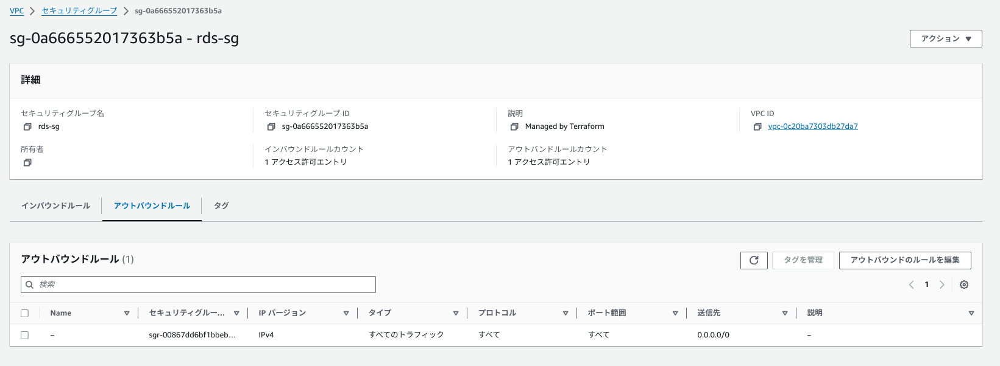
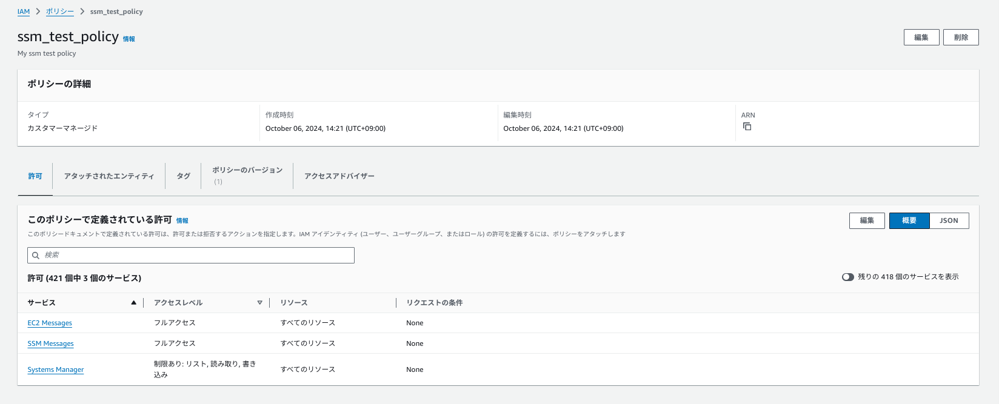

# リソースを変数なしで記述

## 構成されるディレクトリ及びファイル
```
.
├── alb.tf
├── backend.tf
├── ec2.tf
├── provider.tf
├── rds.tf
├── s3.tf
├── sg.tf
└── vpc.tf
```

## 作成するリソースに関して

#### provider.tf  
[作成したコードはこちら](../basic/provider.tf)
<details><summary>provider.tfの記述の説明</summary>

**aws provider**

* 今回使用するTerraformは`version1.9.5`(「1.×.×」以降のメジャーバージョン)なので、AWSプロバイダーバージョンもメジャーバージョンをサポートしている、3.0以降のバージョン(3.×.× 以降が対応する)に設定するように記述しました。

* 作成されるawsリージョンを`東京リージョン ap-northeast-1`に作成されるようにするため、デフォルトでAWSリソースを `ap-northeast-1`で作成されるように記述しました。

**http provider**
* EC2にアタッチするSG22番ポートの許可リソースをマイIPに設定するために記述しました。`.tfファイル`に直接記述するのはセキュアではなく間違えてgitに`push`されてしまったときに不正利用されるのを防ぐ意味で使用しています。SGグループ作成時にも詳しく、解説します。

**local provider**
* AWS上で生成したキーペアをEC2にSSH接続するために指定のlocalPCのパスに保存するために記述しました。.pemファイルでの保存とファイルのパーミッションも指定して保存しています。
</details>

#### backend.tf

[作成したコードはこちら](../basic/backend.tf)

<details><summary>backend.tfの記述の説明</summary>

* 今回は、S3バケット(バケット名`tf-basic-backup`)を作成し、このバケットに`terraform.tfstate`の内容を保存します。
* バケット内のバージョニングも有効に設定しています。
</details>

`terraform apply`で実行したときに実際に`terraform.tfstate`ファイルが保存されているか確認


#### vpc.tf

[作成したコードはこちら](../basic/vpc.tf)
<details><summary>vpc.tfの記述の説明</summary>

**VPC** 
IPv4 CIDR = `10.0.0.0/16` DNS ホスト名 = `有効` DNS 解決=`有効`  タグ値 `Name = tf-vpc`

**IGW**
作成したvpcに`アタッチ` タグ値 `name = tf-igw`

**PublicSubnet**

`ap-northeast-1a`に IPv4 CIDR = `10.0.0.0/20`　タグ値 `Name = tf-network-public-1a` で作成

`ap-northeast-1c`に IPv4 CIDR = `10.0.16.0/20`　タグ値 `Name = tf-network-public-1c` で作成

**PrivateSubnet**

`ap-northeast-1a`に IPv4 CIDR = `10.0.128.0/20`　タグ値 `Name = tf-network-private-1a` で作成

`ap-northeast-1c`に IPv4 CIDR = `10.0.144.0/20`　タグ値 `Name = tf-network-private-1c` で作成

**ルートテーブルを作成**

***PublicSubnetに関連付けるルートテーブル***

ルート
`0.0.0.0/0`,送信先`作成したigw`
`10.0.0.0/16`→作成したVPC IPv4 CIDR内での`local`
→デフォルト値なので、記述なしでも作成されるので今回は記述なし

タグ値 `Name = tf-rtb-public`　で作成

***PublicSubnetに関連付けを行う***

***PrivateSubnetに関連付けるルートテーブル***
* セキュアな設計にするため、１つずつルートテーブルをつくり、サブネットに関連付けをします

ルート
`10.0.0.0/16`→作成したVPC IPv4 CIDR内での`local`
→デフォルト値なので、記述なしでも作成されるので今回は記述なし

タグ値 `Name = tf-rtb-private-1a`　で作成

ルート
`10.0.0.0/16`→作成したVPC IPv4 CIDR内での`local`
→デフォルト値なので、記述なしでも作成されるので今回は記述なし

タグ値 `Name = tf-rtb-private-1c`　で作成

***PrivateSubnetに関連付けをする***

[基本的なネットワークをterraformで作成する](https://zenn.dev/ochi_shoichi/scraps/1e224c1501cc29)
[TerraformでAWS VPCを構築してみる](https://www.ios-net.co.jp/blog/20230405-910/)
[Terraformで構築するAWS](https://y-ohgi.com/introduction-terraform/handson/vpc/)

</details>

<details><summary>実際に作成されたのを確認</summary>


</details>

#### sg.tf

[作成したコードはこちら](../basic/sg.tf)
<details><summary>sg.tfの記述の説明</summary>

[AWSのVPCとEC2を構築してみる](https://kacfg.com/terraform-vpc-ec2/)

***EC2にアタッチするsg***
インバウンド
|タイプ|プロトコル|ポート範囲|ソース|
| ---- | ---- | ---- | ---- |
|HTTP|TCP|80|0.0.0.0/0|
|SSH|TCP|22|マイIPアドレス|

アウトバウンド
|タイプ|プロトコル|ポート範囲|ソース|
| ---- | ---- | ---- | ---- |
|すべてのトラフィック|すべて|すべて|0.0.0.0/0|

* HTTPプロバイダーを使用して自分のIPアドレスを取得する過程で、data "http"ブロックでHTTPデータソースを定義して、外部urlからマイIPを取得する。
* 取得したIPアドレスに/32を追加してCIDR形式に変換し、ローカル変数my_ipに設定する。
* タグ値 `Name = tf-ec2-sg`　で作成

[SGマイIP許可を設定するために使用 ](https://zenn.dev/shz/articles/c1baf28b1fc222)

***RDSにアタッチするsg***
インバウンド
|タイプ|プロトコル|ポート範囲|ソース|
| ---- | ---- | ---- | ---- |
|MYSQL/Aurora|TCP|3306|EC2のSGを許可するリソース|

アウトバウンド
|タイプ|プロトコル|ポート範囲|ソース|
| ---- | ---- | ---- | ---- |
|すべてのトラフィック|すべて|すべて|0.0.0.0/0|

* タグ値 `Name = tf-rds-sg`　で作成

[RDSのSGをEC2のSGで許可するために使用](https://zenn.dev/kmukmu/articles/1cdd4287f52522#rds%E3%80%81security-group%EF%BC%88db%E7%94%A8%EF%BC%89%E3%81%AE%E8%A8%AD%E5%AE%9A)

***ALBにアタッチするsg***
インバウンド
|タイプ|プロトコル|ポート範囲|ソース|
| ---- | ---- | ---- | ---- |
|HTTP|TCP|80|0.0.0.0/0|

アウトバウンド
|タイプ|プロトコル|ポート範囲|ソース|
| ---- | ---- | ---- | ---- |
|すべてのトラフィック|すべて|すべて|0.0.0.0/0|

* タグ値 `Name = tf-elb-sg`　で作成
</details>

<details><summary>実際に作成されたのを確認</summary>

***EC2用セキュリティグループ***


***RDS用セキュリティグループ***



***ALB用セキュリティグループ***


</details>

#### ec2.tf

[作成したコードはこちら](../basic/ec2.tf)
<details><summary>ec2.tfの記述の説明</summary>

***キーペアの作成&ローカルPCのファイルに保存***

* tlsプロバイダの一つである、`tls_private_key`リソースを利用してキーペアを作成する。RSA暗号、4096ビットの秘密鍵/公開鍵のペアを作成。
* AWSのキーペアは公開鍵をopenssh形式で登録する
* キーペアをファイルとして保存したいので、localプロバイダを利用することでローカルにファイルとして保存する。

キーペアの作成＆ローカルへの保存を参考にしたサイト

[terraformを使用して、EC2のキーペアを作成する](https://tech.teshiblog.com/aws/terraform/terraform-create-ec2-keypair/)

***IAMロールの作成***

インスタンスが他のAWSリソースに指定された権限をもってアクセスできるようにする。(今回は、S3とSSMを使用できるようにする)

[terraform公式よりコードを引用](https://registry.terraform.io/providers/hashicorp/aws/latest/docs/resources/iam_role)

***IAMポリシーの作成***

指定したAWSリソース(S3とSSM)にアクセス許可するポリシーを作成

[terraform公式よりコードを引用](https://registry.terraform.io/providers/hashicorp/aws/latest/docs/resources/iam_policy)

[EC2からS3バケットを操作できるようにする](https://zenn.dev/shimiyu/articles/ca03e46a6136ec)

[Amazon S3のアクセスに必要な最低限のIAMポリシーの設定](https://www.jpcyber.com/support/minimal-iam-policy-to-access-amazon-s3)

[EC2にSSMを使用して接続する方法](https://dev.classmethod.jp/articles/ec2-access-with-session-manager/)

[TerraformでIAMロールとIAMポリシーを作成し、アタッチする方法](https://cloud5.jp/terraform-iam/)

***作成したIAMポリシー***を***IAMロール***にアタッチし、***インスタンスプロファイル***を作成。
***インスタンスプロファイル***を元にEC2インスタンスにアタッチします。

***EC2インスタンスの作成***

* 最新のAmazon Linux 2のAMI IDを取得してEC2を構築する
* インスタンスタイプ`t2.micro`
* AZは`ap-northeast-1`東京リージョンを選択
* EC2のSGは作成したSGにする
* パブリックIPの自動割当てはONにする。VPC上の設定で、DNSホスト名を有効にする設定 `enable_dns_hostnames = true`を記述しなければ生成されないので、`vpc.tf`の記述でこれも確認する。
* サブネットは作成した`PublicSubnet`の`north-east-1a`に配置
* SSH接続に使用するキーペアはTerraformで作成したキーペアを選択
* インスタンスプロファイルでEC2にIAMロールをアタッチ
* ユーザデータを使用し、`mysqlクライアント`と`nginx`をインストール。`nginx`は後に作成するターゲットグループのヘルスチェックのため、EC2起動時に自動起動するようにしておく。
* タグ値 `name = tf-main-ec2`

[Terraformで最新のAmazon Linux 2のAMI IDを取得してEC2を構築](https://dev.classmethod.jp/articles/launch-ec2-from-latest-amazon-linux2-ami-by-terraform/)

[EC2作成の設定値の参考](https://kacfg.com/terraform-vpc-ec2/)

[ユーザデータを参考にした、nginxをインストールしたEC２インスタンスを作成する](https://qiita.com/ramunauna/items/57bd4235b89c059b296f)

[IAMロールをEC2️インスタンスに割り当てる](https://cross-black777.hatenablog.com/entry/2015/12/04/233206)

***ElasticIP***を新たに作成し、EC2️にアタッチ

* タグ値 `name = tf-ec2-eip`

[ElasticIPの作成とインスタンスにアタッチ](https://itport.cloud/?p=19915#2-2)

</details>

<details><summary>実際に作成されたのを確認</summary>

***AWS上にキーペア作成を確認***


***Localファイルに.pemファイルでキーペアの保存を確認***


***IAMPolicy S3アクセス用***


***IAMPolicy SSM用***


***IAMRole EC2用***


***IAMRoleに作成したIAMPolicy2つがアタッチされているか確認***


***EC2の作成を確認***

* キーペアが作成したもの`ec2-keypair.pem`であるか
* IAMRoleが作成したもの`test_role`がアタッチされているか
* SGが作成したもの`web-sg`が与えられているか
* パブリックIPv4 DNSが与えられているか
* ElasticIPがアタッチされているか


</details>

#### rds.tf  
[作成したコードはこちら](../basic/rds.tf)
<details><summary>rds.tfの記述の説明</summary>

***サブネットグループの作成***
* 今回は、作成した`north-east-1a`と`north-east-1c`の`PrivateSubnet`を設定してサブネットグループを作成する。
* 名前は、`tf-test-rds`。

[サブネットグループ&RDSを作成](https://cloud5.jp/terraform-rds/)

***RDSの作成***

* 設定図は下記の表参照。

|設定項目|設定値|解説・備考|
| ---- | ---- | ---- | 
| allocated_storage  | 20|ストレージの割り当てサイズを指定。今回はコストを考慮して最小値を設定。|
| storage_type |gp2|  ストレージタイプを設定。 |
|engine| mysql|使用するDBエンジンを設定。今回はMySQL|
|engine_version|8.0|使用するDBエンジンバージョンを設定。今回は8.0を設定。|
|instance_class| db.t3.micro|使用するインスタンスクラスを設定。コストを考慮して最小スペックを選択。|
|identifier|tf-rds|インスタンス識別子を設定。今回は、tf-rdsを設定。|
|username|admin|ユーザ名を指定。|
|password|mypassword|初期値はmypasswordに設定。後ほど、RDSに接続した際、パスワードを手動で切り替え予定。|
|skip_final_snapshot |true|RDS削除時に、スナップショットをとるかを設定。trueの場合、とらないで削除。falseの場合、とって削除する。|
|vpc_security_group_ids| [aws_security_group.rds.id]|RDS用に関連付けるSGIDを設定。|
|db_subnet_group_name|aws_db_subnet_group.main.name|配置するDBインスタンス用サブネットグループを設定。|
|availability_zone| ap-northeast-1a|Single-AZ構成にするときのみ設定できる。今回は、東京リージョンのap-northeast-１aに設定。|
|multi_az |false|multi-AZにするかの設定。falseの場合は、single-AZ構成。trueの場合、multi-az構成にする。|

* 必要に応じて、その他のオプション設定をしてください。

[こちらを参照](https://github.com/tushiko23/CLI-AWS/blob/modify/cLI-command/cli-command-RDS.md)

[サブネットグループ&RDSを作成](https://cloud5.jp/terraform-rds/)

</details>

<details><summary>実際に作成されたのを確認</summary>

***サブネットグループ***


***RDSの作成確認***
！[](images/rds.png)

</details>

#### alb.tf  
[作成したコードはこちら](../basic/alb.tf)
<details><summary>alb.tfの記述の説明</summary>

***ターゲットグループ***の作成

|設定項目|設定値|解説・備考|
| ---- | ---- | ---- | 
|  name  | test-target-group|ターゲットグループ名を指定。今回はtest-target-groupを設定。|
| target_type  |instance|  ターゲットタイプを設定。作成したEC2にALBを設定したいため、instanceを設定 |
|  protocol_version |HTTP1|  プロトコルバージョンの設定。デフォルトはHTTP1 |
|port |80|ポートを指定|
|protocol|HTTP|プロトコルを指定。|
|vpc_id|aws_vpc.main_vpc.id|作成したVPC_idを指定。|
|tags|Name = tf-test-target-group|タグ値を設定。|

***ヘルスチェック***
|設定項目|設定値|解説・備考|
| ---- | ---- | ---- | 
|interval |	30 |	ヘルスチェックを行う間隔。|
|path |	/ |	要件がないためデフォルト値。|
|port |	traffic-port |	要件がないためデフォルト値。 |
|protocol |	HTTP |	プロトコルの設定。|
|timeout |	5 |	タイムアウト値。 |
|healthy_threshold |	5 |	正常のしきい値。|
|unhealthy_threshold |	2 |	非正常のしきい値 |
|matcher |	200 |	成功コード。HTTPのみなので、200にした。HTTPSも入ると、300に設定する。|

***作成したターゲットグループにインスタンスを登録***

|設定項目|設定値|解説・備考|
| ---- | ---- | ---- | 
target_group_arn | aws_alb_target_group.test_target_group.arn|	作成したターゲットグループのARNを指定 |
|target_id | aws_instance.main_ec2.id | 作成したEC2インスタンスIDを指定 |

***ALBの作成***

|設定項目|設定値|解説・備考|
| ---- | ---- | ---- | 
|name  | test-alb-tf|	ALBの名前を設定。ここでは、test-alb-tfを設定。|
|internal |	false |	外部に公開するアプリケーションを想定しているため。|
|load_balancer_type |	application |	ロードバランサの種類はALBを指定。|
|security_groups | aws_security_group.elb.id|	ALB用に作成したSGを指定。必ず記述するときは、[]をつけること。 |
|subnets |aws_subnet.public_1a.id,aws_subnet.public_1c.id|	作成した2つのパブリックサブネットを指定。必ず記述するときは、[]をつけること。|
|ip_address_type |	ipv4 |	ipv6を使用しないためipv4のみ指定。|
|tags |	name = "tf-test-alb" |	タグを設定。今回は、tf-test-albを指定。|

***リスナールールの設定***

|設定項目|設定値|解説・備考|
| ---- | ---- | ---- | 
|load_balancer_arn | aws_alb.test_alb.arn |	ALBのARNを指定。|
|port |	80 |	ポートを設定。|
|protocol   |	HTTP |	プロトコルを設定。|
|default_action | 	type = forward          target_group_arn =  aws_alb_target_group.test_target_group.arn |	作成したターゲットグループのARNを指定。|

[参考サイト](https://cloud5.jp/terraform-alb/#4-2-)

</details>

<details><summary>実際に作成されたのを確認</summary>

***ターゲットグループ(インスタンスの登録も確認)***


***ALBのリスナールールとセキュリティグループの関連付け***


</details>

#### s3.tf  
[作成したコードはこちら](../basic/s3.tf)
<details><summary>s3.tfの記述の説明</summary>

* バケット作成。タグ値`name = test-s3-bucket`
* `aws_s3_bucket_public_access_block`パプリックアクセスを****バケット単位**** でブロックする設定。
* `aws_s3_account_public_access_block`パブリックアクセスを****アカウント単位****でブロックにする設定。
* オンにする場合は`true`をオフにする場合は`false`を選択する。

`block_public_acls`
「新しいアクセスコントロールリスト (ACL) を介して付与されたバケットとオブジェクトへのパブリックアクセスをブロックする」

`ignore_public_acls`
「任意のアクセスコントロールリスト (ACL) を介して付与されたバケットとオブジェクトへのパブリックアクセスをブロックする」

`block_public_policy`
「新しいパブリックバケットポリシーまたはアクセスポイントポリシーを介して付与されたバケットとオブジェクトへのパブリックアクセスをブロックする」

`restrict_public_buckets`
「任意のパブリックバケットポリシーまたはアクセスポイントポリシーを介したバケットとオブジェクトへのパブリックアクセスとクロスアカウントアクセスをブロックする」

コードの設定では、アカウントレベルではパブリックアクセスを許可し、バケットパブリックアクセスをブロックしている設定を行っている。
なお、コードの表記がない場合はデフォルトでパプリックアクセスをオフになっている。

[S3のバケットのブロックパブリックアクセスを設定](https://zenn.dev/hige/articles/01b69444ccaa3d)

[S3のアカウントのブロックパブリックアクセスを設定](https://blog-benri-life.com/terraform-aws-s3-account-public-access-block/)

***バージョニングを有効化***

* 作成したバケット名を指定し、versioning_configuration status = "Enabled"で有効化する。

[バージョニングを有効化にする設定](https://registry.terraform.io/providers/hashicorp/aws/latest/docs/resources/s3_bucket_versioning)

</details>

<details><summary>実際に作成されたのを確認</summary>

***S3バケット作成＆バージョニング有効設定がオンになっているか確認***


***S3のバケットのブロックパブリックアクセス設定がオンになっているか確認***


***S3のバケットのブロックパブリックアクセス設定がオフになっているか確認***


</details>


## 動作確認

### `terraform apply`で実行して、リソースの生成が正常に終了したことを確認


### EC2にキーペア使用でSSH接続し、RDSに接続


### EC2にSSM使用でSSH接続し、RDSに接続


### RDSの初期パスワードを変更する

```
ALTER USER '<RDSで設定したマスタユーザ名>'@'%' IDENTIFIED BY '設定したいパスワード';
#今回はユーザ名 admin パスワードはnew_passwordに変更
#成功すると以下が返ってくる
Query OK, 0 rows affected (0.00 sec)
```


### ターゲットグループのヘルスチェック
Nginxの動作を確認


### `terraform destroy`コマンドにてリソースの削除を確認


### 感想
* 苦労した点は、SSM用のIAMポリシーがIAMロールにアタッチされ、EC2にアタッチされたにもかかわらず、SSMの接続ボタンが作動せず接続できなかったところです。原因はおそらく、IAMポリシーでSSMで接続する必要な権限が不足していて接続できなかったのかと思われます。参考サイトをしっかり見て、IAMポリシーを作成したら、接続ができました。
* EC2のキーペアも思い通りにローカルPCに保存されず、SSH接続ができないという事例もありました。AWSキーペアの作成の工程はもう少し簡単にできそうなので、模索してみます。
* .gitignoreファイルを作成し、pushしてバージョン管理すべきリソースの区別することは、大切だと思いました。git pushで隠しディレクトリ・ファイルがpushされることまで配慮して必要ないリソースはpushされないように確認していきたいです。