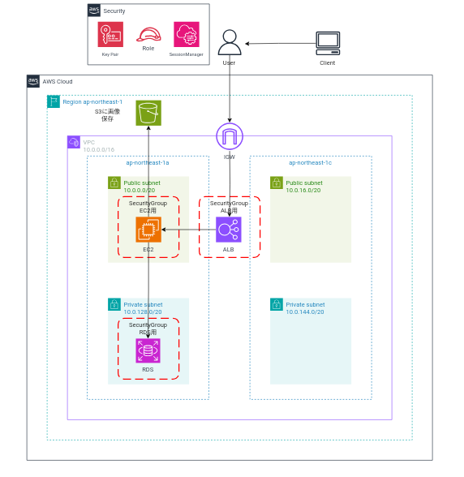

# moduleブロックを使用して、第5回課題のAWSリソースを構築する

* [こちらのサイト](https://github.com/cnc4e/terraform-practice/blob/main/step5-module/README.md)を参考にして記述しました

**作成する構成図**



## 親モジュールをリソースとして子モジュールで参照する

### 1. ディレクトリごとにTerraform実行環境を分け、親モジュールに作成したいAWSリソースを記述する方法

#### 下準備
Terraform実行環境に`chapter-6`ディレクトリを作成し、`chapter6`ディレクトリ下に親モジュール用に`directory-1`、子モジュール用に`directory-2`ディレクトリを作成する

```
# 実行環境用ディレクトリを作成

mkdir chapter6
cd $_

# 実行環境ディレクトリ下(今回は"chapter-6")に親モジュール用、子モジュール用ディレクトリを作成

mkdir directory-1 directory-2
```

**ディレクトリ構成**

```
# ディレクトリ"directory-1"
# (ここでは親モジュールにあたります)

├── directory-1
│   ├── provider.tf
│   ├── backend.tf
│   ├── variables.tf
│   ├── vpc.tf
│   ├── sg.tf
│   ├── iam.tf
│   ├── ec2.tf
│   ├── rds.tf
│   ├── alb.tf
│   └── s3.tf

# ディレクトリ"directory-2"
# (親モジュールにあたる"modulesブロック"で参照する)

├── directory-2
│   └── main.tf
```

**[変数ありvar](../var/var.md)との記述の違いと変更点**

* 親モジュールでは基本的なコードの書き方は変数ありの場合の記述と変わりません。
* 前回は、[ec2.tf](../var/ec2.tf)にEC2にアタッチするIAMポリシー、IAMロールを記述していましたが、今回は、別に[iam.tf](./file-1/iam.tf)を作成し、EC2にアタッチするIAMポリシー、IAMロールを記述します。

* 任意の変数値を作成する[terraform.tfvars](../var/terraform.tfvars)を作成せず、子モジュールの[main.tf]()に作成したいリソースの変数値(例えば、VPCのCIDRブロックなど)を記述します。
* なお、子モジュールで変数値を指定しなかった(main.tfに変数値を記述しなかったという意味)の場合、親モジュールに指定しているdefaultの変数値を定義しているファイル[valiables.tf](./file-1/variables.tf)を参照して作成されるものとします。

<details><summary>親モジュール"directory-1"で記述したコードはこちらから</summary>

子モジュールでコード実行中にwarningが生じましたので、親モジュールの
`provider.tf`と子モジュールの`main.tf`のprovider記述内容を変更しました。

[詳細はこちらから](../task/environment/provider-modify.md)

#### provider.tf

[作成したコードはこちら](./file-1/provider.tf)

#### backend.tf

[作成したコードはこちら](./file-1/backend.tf)

#### variables.tf

[作成したコードはこちら](./file-1/variables.tf)

#### vpc.tf

[作成したコードはこちら](./file-1/vpc.tf)

#### sg.tf

[作成したコードはこちら](./file-1/sg.tf)

#### iam.tf

[作成したコードはこちら](./file-1/iam.tf)

#### ec2.tf

[作成したコードはこちら](./file-1/ec2.tf)

#### rds.tf

[作成したコードはこちら](./file-1/rds.tf)

#### alb.tf

[作成したコードはこちら](./file-1/alb.tf)

#### s3.tf

[作成したコードはこちら](./file-1/s3.tf)

#### main.tf

</details>

**子モジュールにて、親モジュールをリソースとしてAWSリソースを作成**

***コードの説明***
```
# main.tf内
# moduleの利用
# moduleブロックと"任意のプロジェクト名を指定"
# 基本的なmoduleの書き方
module "リソースの名前" {
    source = "モジュールを定義したフォルダのパス"
    パラメーター名 = "パラメーター値"
}

module "任意のプロジェクト名を指定" {
  # モジュールを定義したフォルダのパㇲ
  source = "../directory-1"

  # 指定したいパラメーター値の設定(変数ありの”terraform.tfvars"にあたる)
  # デフォルト値でよいものは記述しないでOK
  # Networkのパラメーター値を指定
  
  # Networkリソースのみ変数の値を設定
  # 1. VPCのCIDRブロック
  # 2. プロジェクト単位で分析できるようにするためのタグ値
  # 3. ap-northeast-1aのPublicSubnetのCIDRブロック
  # 4. ap-northeast-1cのPublicSubnetのCIDRブロック
  # 5. ap-northeast-1aのPrivateSubnetのCIDRブロック
  # 6. ap-northeast-1cのPublicSubnetのCIDRブロック

  my_vpc_cidr_block = "172.1.0.0/16"
  name_base         = "paractice-modules"
  my_pubsub_1a_cidr = "172.1.0.0/20"
  my_pubsub_1c_cidr = "172.1.16.0/20"
  my_prisub_1a_cidr = "172.1.128.0/20"
  my_prisub_1c_cidr = "172.1.144.0/20"

}
```

**子モジュール`directory-2`ディレクトリ下の`main.tf`で記述したコード**

#### main.tf

[記述したコードはこちら](./file-2/main.tf)

## `foreach`,`三項演算子`を使用し、親モジュールから作成したいリソースのみを絞って作成する方法

## 親モジュールをリソースとして、`foreach`を使用して、AWSリソースを複数作成する
