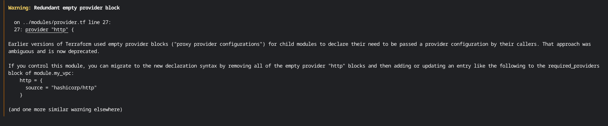
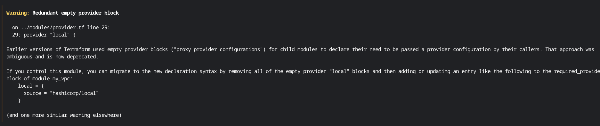
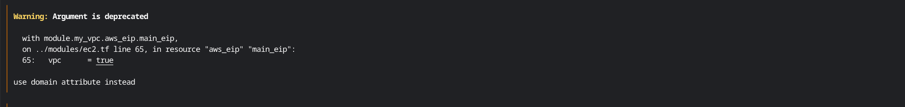

## コードの実行途中でProviderの記述に関してwarningが表示された件

moduleでの、provider.tf内でHTTPプロバイダとLocalプロバイダの記述に関して、以下のようなwarningが出ました。






エラーメッセージ内容

子モジュールで宣言するために、記している構文は以前は空のプロバイダブロックを使っていたが、現在は非推薦とされている。

解決方法

このモジュールを完全にするには、空の`httpブロック`及び`localブロック`をまず削除し、`required_providersブロック`の次に以下が続くように記述するとよい。
```
http = {
source = "hashicorp/http"
} 

local = {
source = "hashicorp/local"
} 
```


変更後のコード
* プロバイダのバージョンに関しては、[こちら](https://registry.terraform.io/browse/providers)から調べました。

```
terraform {
  required_providers {
    aws = {
      source  = "hashicorp/aws"
      version = "~> 5.0" # バージョンの指定は最新のものに設定
    }
    http = {
      source  = "hashicorp/http"
      version = "~> 3.0" 
    }
    local = {
      source  = "hashicorp/local"
      version = "~> 2.1" 
    }
}
}

# 以前の記述の仕方はコメントアウト
# provider "http" {
  # HTTP providerの設定  
# }

# provider "local" {
  # Local providerの設定
# }

```

## TerraformのAWSプロバイダーのバージョンが5.0以降に変更されていたので、3.0から変更したらeipの記述がwarningが出た件

[こちらの参考サイト](https://zenn.dev/shz/articles/c1baf28b1fc222)にてAWSプロバイダーを3.0から5.0に変更したところ、ElasticIP作成の記述にてwarningが出ました。



`vpc = true` を `domain = "vpc"`に変更しました。

[解決に使用したサイト](https://omkz.net/terraform-vpc-use-domain/)

```
resource "aws_eip" "main_eip" {
  instance = aws_instance.main_ec2.id
  # vpc    = true を削除して変更
  domain   = "vpc"
  tags = {
    Name = "${var.name_base}-eip"
  }
```

これらに変更すると、warningのメッセージが表示されずコマンドを実行することができました。