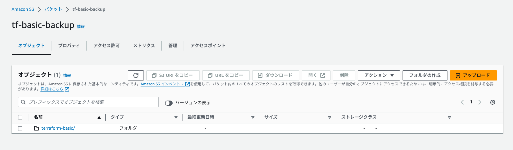
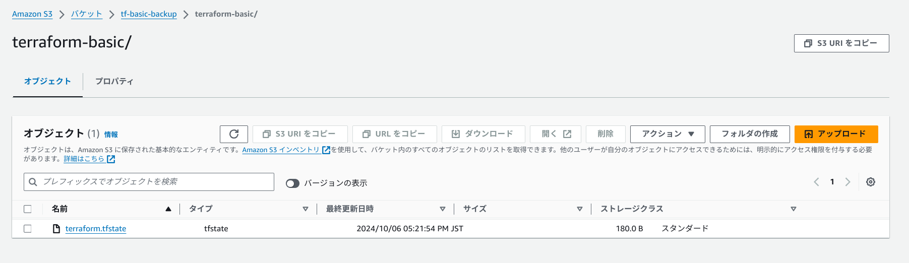
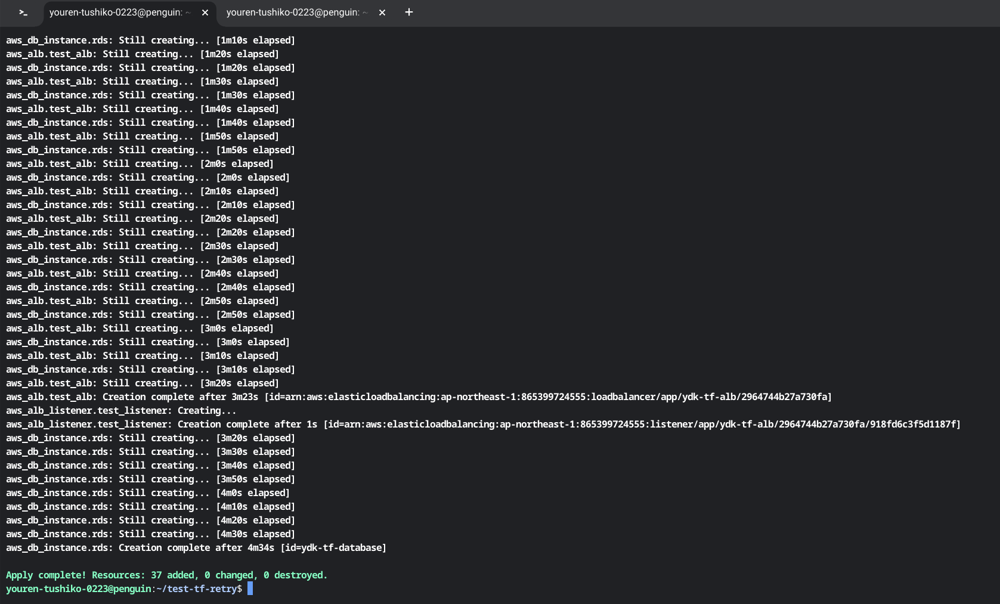
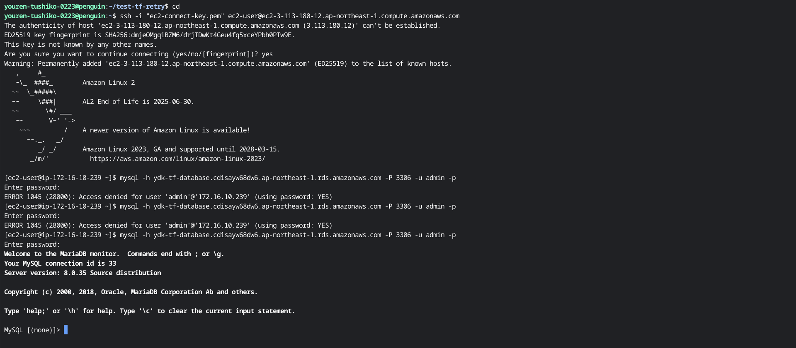
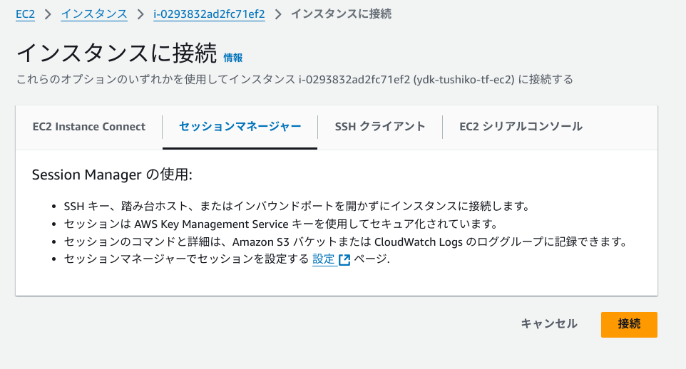
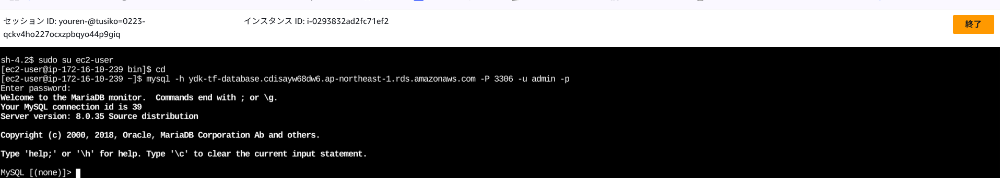
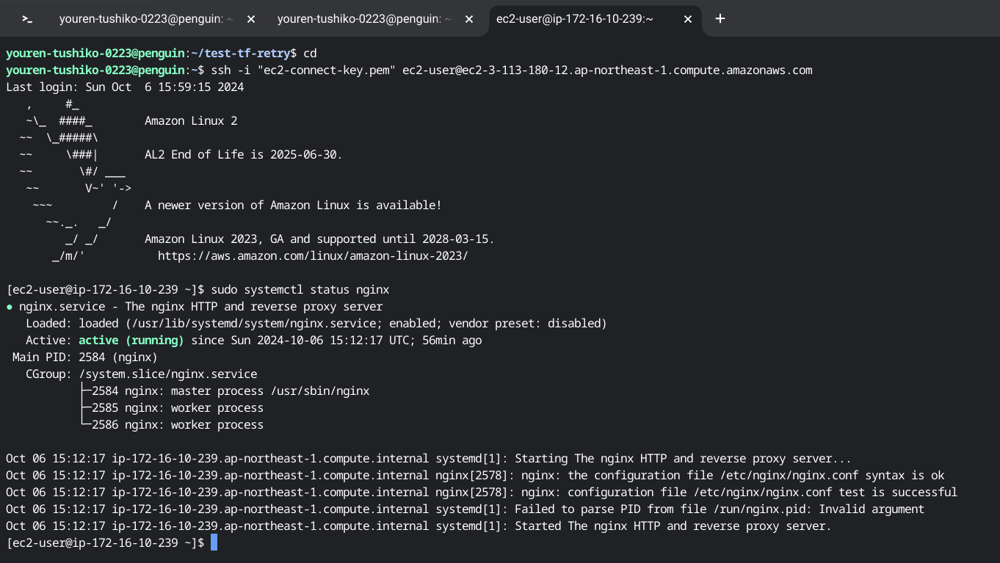
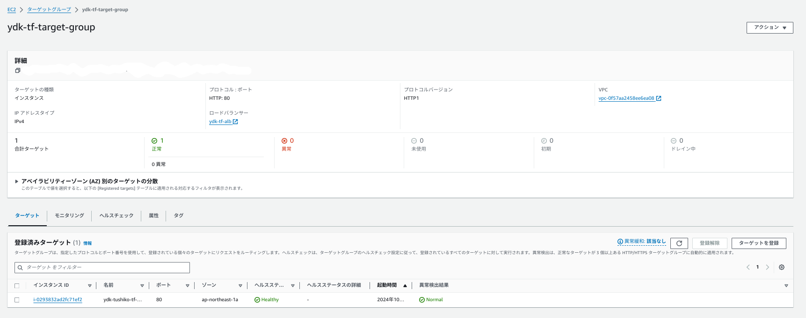
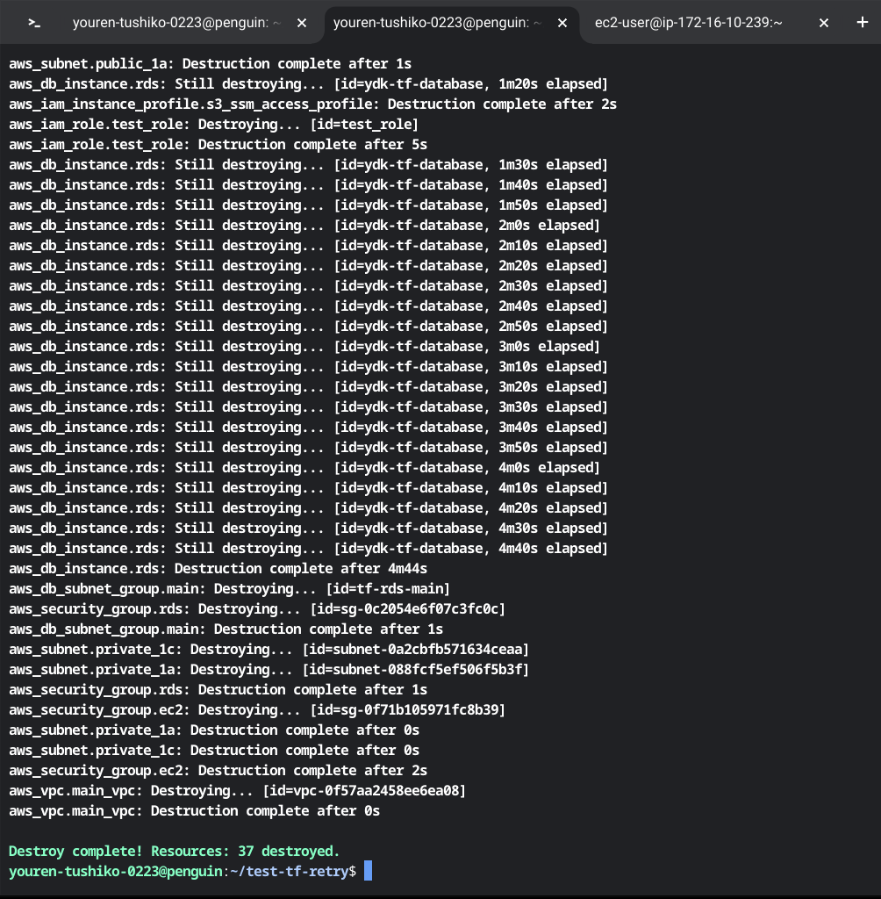

# リソースを変数ありで記述
***CFnでいう、パラメータ値のようなもの***

## 構成されるディレクトリファイル
```
.
├── alb.tf
├── backend.tf
├── ec2.tf
├── provider.tf
├── rds.tf
├── s3.tf
├── sg.tf
├── vpc.tf
├── variables.tf         # デフォルトの変数を記述する
└── terraform.tfvars     # 作成したい変数値を記述する
```

## 作成するリソースに関して

`provider.tf`から`S3.tf`までのリソースの解説に関しては変数なしでの記述を参照にしてください。

[変数なしでの記述はこちら](../basic/basic.md)

### 変数ファイルの作成

#### tfファイル`variable.tf`を作成し、variableで変数定義の記述する。
Cloudformationでは、それぞれに作成するリソースの`.ymlファイル`内の一番最初に変数定義を記述していましたが、今回は冗長になることと後にでてくる`module`定義で記述する際`defalt`の変数を使用できるようにするため、***variable.tf***ファイルに(デフォルトの)変数を記述して使用します。

#### 基本的な記述
variable変数で記述
```
# ----------
# 変数でVPCのIPv4CIDRを記述
# ----------
# defaultは記述しないでもOK。記述がある場合は、変数に値を設定しない場合にdefault値
が適用される

variable "my_cidr_block" {
default = "10.0.0.0/16"
}
variable "my_env" { default = tf-test }

# variable "記述したいリソース"{ default = "作成したい値"}  
# デフォルト値を定めない場合は下記のようになる
variable "my_cidr_block" {}
variable "my_env" {}
```


[variables.tfとterraform.tfvarsの違いを改めて言語化してみた](https://cloudnized.com/2022/11/21/verbalize_difference_between_variables-tf_and_terraform-tfvars/)

[Terraform で変数を使う](https://qiita.com/ringo/items/3af1735cd833fb80da75)

定義した値を受け取る。例えば、`vpc.tf`で使用する場合は以下のようになる

```
# ----------
# リソース定義
# ----------
# VPCを作る
resource "aws_vpc" "main_vpc" {
cidr_block = var.my_cidr_block # v0.12以降の書き方
enable_dns_support = true
enable_dns_hostnames = true
tags = {
Name = "terraform-${var.my_env}" # 文字列内に変数を埋め込む場合はこの書
き方（v0.11形式）
}
}
```

変数の表し方は以下のようになる

```
#定義した値を直接記載する場合

var.<variableで記載した値>

#定義した値を文字内の変数に埋め込みたい場合
#＄｛var.<variableで記載した値>｝で記載する

Name = "terraform-${var.my_env}
```

***terraform.tfvars***ファイルに変更したい変数の値を記述して使用します。

```
# ------------------------------
# vpcのcidr_block
# ------------------------------
my_vpc_cidr_block = "172.16.0.0/16"

# ------------------------------
# プロジェクト名を識別するタグ名
# ------------------------------
my_env = "ydk-tushiko-tf"

```

#### variable.tf 
こちらに`default`で使用する変数を記述します

[作成したコードはこちら](../var/variables.tf)

#### terraform.tfvars
こちらに、今回使用したい変数値を記述します。`default値`を使用したい場合はここに記述しなくてもOK！

[作成したコードはこちら](../var/terraform.tfvars)

### 変数を使用してそれぞれのリソースを記述

#### vpc.tf

[作成したコードはこちら](../var/vpc.tf)

#### sg.tf

[作成したコードはこちら](../var/sg.tf)

#### ec2.tf

[作成したコードはこちら](../var/ec2.tf)

#### rds.tf

[作成したコードはこちら](../var/rds.tf)

#### alb.tf

[作成したコードはこちら](../var/alb.tf)

#### s3.tf

[作成したコードはこちら](../var/s3.tf)

### 変更なしのファイル

#### provider.tf

[作成したコードはこちら](../var/provider.tf)

#### backend.tf

[作成したコードはこちら](../var/backend.tf)

* それぞれのリソースの作成確認は容量ファイルの制限の関係のため今回は割愛します。

## 動作確認

#### `terraform apply`で実行したときに実際に`terraform.tfstate`ファイルが保存されているか確認




### `terraform apply`で実行して、リソースの生成が正常に終了したことを確認



### EC2にキーペア使用でSSH接続し、RDSに接続


### EC2にSSM使用でSSH接続し、RDSに接続



### ターゲットグループのヘルスチェック
Nginxの動作を確認




### `terraform destroy`コマンドにてリソースの削除を確認


### 感想
* IAMロールにS3バケットを変数で示すのに`var.s3_name`ではなく、`${var.s3_name}`を使用すればよいことがわかりました。変数を使うと、S3にアクセルするポリシー内にS3バケット名を個別に記述する必要がなく、省力的なので、変数を使用していきたいと思います。
* RDSのユーザ名・パスワードなどは、直接記述するのではなく、`terraform.tfvars`に記述する方法は大変有効だと思いました。しかし、`terraform.tfvars`がpushされるとパスワードがまるわかりなので、pushするときは本当のパスワードは記述せず、passwordは設定すると説明を加えると良いと思いました。
* 変数をどこまで使うのか、今回はほぼすべて変数が使えるところは`terraform.tfvars`にすべて記述しましたが、デフォルト値でいいものはあえて記述せずに運用する方法もありだと思いました。また今回は、別で変数を`variable.tf `に記述しましたが、CFｎのように`vpc.tf`や`sg.tf`に一緒に書いたほうがレビュー者は見やすいので、どちらの運用がいいかはその都度相談して運用したいと思います。
